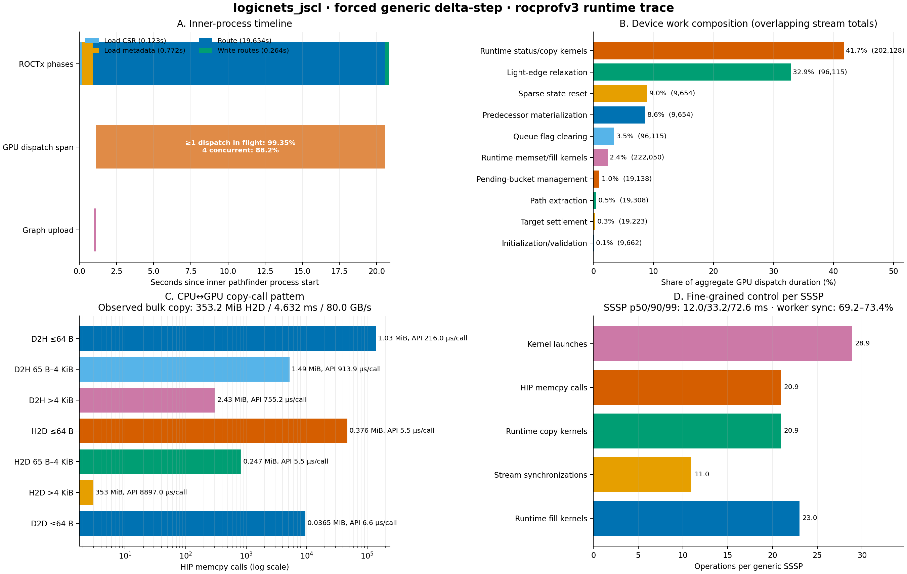

# `logicnets_jscl` forced-generic Delta-Stepping profile

This report analyzes `39155_results.db`, the RocPD SQLite database produced by:

```bash
make ROUTER=PathFinderFile BENCHMARKS="logicnets_jscl" VERBOSE=1 \
  PATHFINDER_SSSP_ENGINE=delta-step \
  PATHFINDER_ARGS="--max-sssp-iters 2147483647" \
  PATHFINDER_PROFILE=rocprofv3 \
  PATHFINDER_PROFILE_RUN=delta-generic
```

The database covers only the inner `pathfinder` process. It excludes
`interchange_to_csr`, `routes_to_phys`, the checker, wirelength analysis, and
other Makefile work. The runtime trace is useful for attribution but perturbs
timing; it is not a profiler-free performance baseline.
The profiled inner command also used `--allow-unrouted`; the database contains
no checker result, so every performance A/B must verify equivalent routing
coverage and correctness.



The raw metrics used by this report are in [`summary.json`](summary.json). They
can be regenerated with:

```bash
python3 CongestionFreeRouting/profiling/analyze_rocpd.py \
  39155_results.db \
  --output-dir CongestionFreeRouting/profiling/39155_analysis
```

## Main result

The dominant observed operation pattern, and the leading optimization
hypothesis, is fine-grained CPU/GPU control traffic. Bulk transfer-engine time
is demonstrably negligible in this trace, but an implementation A/B is still
required to prove the causal wall-time benefit of removing the control traffic.
The run performs 9,654 generic SSSP calls and issues:

| Operation | Total calls | Calls per SSSP |
| --- | ---: | ---: |
| Kernel launches | 278,869 | 28.89 |
| HIP asynchronous copies | 202,142 | 20.94 |
| ROCclr `copyBuffer` dispatches | 202,128 | 20.94 |
| ROCclr fill dispatches | 222,050 | 23.00 |
| Stream synchronizations | 105,770 | 10.96 |

Of the HIP copy calls, 195,777 (96.85%) move at most 64 bytes. Device-to-host
copies make 144,385 calls but move only 4.95 MiB in total. Their HIP API calls
consume 35.00 aggregate seconds across eight overlapping workers. Each worker
spends 69.2--73.4% of its active span in `hipStreamSynchronize` and another
21.9--23.5% inside `hipMemcpyAsync`.

By contrast, the transfer-engine track records 353.2 MiB of graph upload in
4.632 ms at an observed effective copy rate of 79.95 GB/s and 0.199 MiB of
device-to-host data in 0.055 ms. All 24 direct transfer-engine records total
4.688 ms, or 0.022% of
the inner process lifetime. On this APU, that effective rate describes copies
between ROCm allocations; it is not a discrete-GPU PCIe bandwidth result.

The count and size pattern strongly indicates that the 202,128 non-bulk HIP
copies are implemented by the 202,128 ROCclr `copyBuffer` dispatches. RocPD did
not preserve a usable API-to-dispatch correlation ID, so this mapping is an
inference rather than a direct join.

## Effects by resource

### Host RAM and CPU-side work

The inner process lasts 20.895 s. Its top-level ROCTx phases are:

| Phase | Wall time | Inner-process share |
| --- | ---: | ---: |
| Load CSR | 0.123 s | 0.59% |
| Load metadata | 0.772 s | 3.69% |
| Route (`pathfinder.run`) | 19.654 s | 94.06% |
| Write routes | 0.264 s | 1.26% |

Load and write ranges mix file I/O, parsing, allocation, and CPU memory access;
they do not isolate DRAM latency. The database has no CPU cache, IBS, NUMA, or
DRAM-controller counters, so it cannot attribute their 5.55% combined share to
RAM latency.

### GPU memory and compute

GPU dispatches span 19.441 s and their interval union is busy for 19.315 s,
99.35% of that span. Four dispatches are active for 88.16% of the span. Eight
software streams map onto four non-default hardware queues, so the GPU is not
idle waiting for more submissions. Much of its busy time is runtime control
work rather than graph relaxation.

The following are aggregate dispatch durations. They overlap across queues and
must not be added to wall time or interpreted as direct speedups:

| Dispatch class | Calls | Aggregate duration | Aggregate share |
| --- | ---: | ---: | ---: |
| Runtime status/copy kernels | 202,128 | 30.826 s | 41.72% |
| Light-edge relaxation | 96,115 | 24.287 s | 32.87% |
| Sparse touched-state reset | 9,654 | 6.649 s | 9.00% |
| Predecessor materialization | 9,654 | 6.391 s | 8.65% |
| Queue-flag clearing | 96,115 | 2.573 s | 3.48% |
| Runtime memset/fill kernels | 222,050 | 1.769 s | 2.39% |
| Pending-bucket management | 19,138 | 0.748 s | 1.01% |

The `copyBuffer` median is only 1.72 microseconds, but its p99 is 3.32 ms. The
4.93% of copies lasting at least 1 ms contribute 82.0% of its aggregate
duration, which is consistent with queue/resource contention. The trace does
not establish the cause of the long tail. A worker-count sweep is needed to
distinguish useful latency hiding from oversubscription.

This trace contains zero PMC, counter-collection, and sampling rows. It cannot
separate:

- cache and shared-memory DRAM latency;
- achieved memory bandwidth;
- VMEM dependency stalls and atomic contention;
- wave occupancy and eligible-wave limits; or
- VALU/SALU utilization and instruction throughput.

Static register counts and a busy timeline do not answer those questions.

### CPU/GPU transport or "networking"

The profiler identifies an AMD Ryzen AI Max+ 395 with integrated Radeon 8060S
(`gfx1151`, 40 CUs, wave32). AMD's [platform specifications](https://www.amd.com/en/products/processors/desktops/ryzen/ryzen-ai-halo/ryzen-ai-max-plus-395.html)
list the 8060S as integrated graphics backed by LPDDR5x, and AMD's
[architecture overview](https://www.amd.com/en/developer/resources/technical-articles/2025/amd-ryzen-ai-max-395--a-leap-forward-in-generative-ai-performanc.html)
describes unified memory shared by the accelerators. This machine therefore
does not provide independently measurable RAM, discrete VRAM, and PCIe-network
effects. The HSA agent's unavailable latency fields are zero; zero must not be
interpreted as zero-latency transport.

The actionable transport result is therefore about transaction granularity:
bulk copies are negligible, while hundreds of thousands of tiny status copies
and their dependent synchronizations dominate call count and aggregate dispatch
exposure. A discrete AMD GPU rerun is required before generalizing to PCIe or
dedicated-VRAM hardware.

### Allocation and repeated state passes

The trace contains 740 GPU allocation/free pairs and about 4.19 GiB of tracked
GPU-agent-attributed allocations on this UMA system, including roughly 353 MiB
of shared graph arrays and about 492 MiB of per-worker generic state for each of
eight workers. Some 633 GPU allocations are smaller than 64 KiB. `hipMalloc`
totals only 33 ms, while `hipFree` totals 2.826 aggregate seconds across
workers, which is consistent with possible implicit synchronization rather
than raw allocator cost. Pooling/reuse and metadata-based pre-reservation
deserve an A/B test, but they are secondary to the status-loop hypothesis.

## Optimization recommendations

### Immediate configuration change

Do not use this forced-generic mode for the production `logicnets_jscl` result.
The current converter writes every edge weight as exactly `1.0f`, and the
finite `--max-sssp-iters` value disables the exact-unit Delta specialization.
The full-device CSR also has 28,226,432 rows, above that specialization's
`2^24`-row guard, so removing the finite option alone does not activate it on
this graph. Use the default `unit-bfs` engine for the production baseline and
compare it with generic Delta-Stepping. Test the Delta exact-unit path only on
an eligible smaller/bounded CSR unless its float-depth guard is redesigned.

### Generic Delta-Stepping order after the counter follow-up

1. Eliminate predecessor materialization and exact-edge row recovery, ideally
   by publishing a compact original predecessor-edge ID with the winning key.
2. Reduce sparse touched-state reset, starting with mode-specialized removal of
   writes that are already made logically stale by distance/key validity.
3. Keep loop-control state on the GPU. Replace intermediate scalar D2H copies
   and `hipStreamSynchronize` calls with device-side iteration/termination or
   larger device-controlled batches.
4. Use compact 32-bit row/edge state when graph size permits, then measure the
   cache and traffic effect.
5. Test 1, 2, 4, and 8 workers. All four observed ROCm queues have a dispatch
   in flight for most of the kernel span; four workers may preserve throughput
   while reducing tail latency and duplicated state, but CU and memory-system
   saturation are unknown.
6. Pre-reserve and reuse query/path buffers to avoid small reallocations and
   synchronizing frees.
7. Collect reached-row degree histograms before implementing degree-aware
   scheduling. Deprioritize ROCclr copy/fill and pending-bucket redesigns: the
   counter profile measures them at only about 1% each.

The four-slot aggregate-work lower bound is 18.471 s versus a 19.441 s observed
GPU span, so merely filling submission gaps has only about 5% headroom under
the same observed four-dispatch scheduling model. HIP Graph capture should
remain behind removal of the host/device decision loop. This bound is
descriptive, not a speedup prediction or a hardware-utilization measurement.

Pending-bucket compact/reduce work is only 1.01% of aggregate dispatch duration
here, but this graph is unit-weight and all-light. The result cannot rank
circular buckets, light/heavy adjacency partitioning, or other genuinely
weighted-graph designs.

### Unit-BFS implications

This database contains no Unit-BFS dispatches, so it is not evidence for a
Unit-BFS reordering. It does reinforce the existing roadmap's first two tests:
find the best worker count and batch multiple BFS levels before checking status
on the host. A production Unit-BFS trace must confirm the exact call mix.

## Required follow-up tests

These tests remain useful for validating the reordered optimization roadmaps.
Target `logicnets_jscl_PathFinderFile.phys` directly to avoid checker and
wirelength work.

### 1. Profiler-free backend and worker matrix

Run one warm-up and at least five measured repetitions for workers `1`, `2`,
`4`, and `8`. `PATHFINDER_PROFILE=custom PATHFINDER_PROFILE_PREFIX=env` forces
the routed target to rerun while adding no profiler wrapper of consequence.

Production Unit-BFS:

```bash
make ROUTER=PathFinderFile BENCHMARKS="logicnets_jscl" VERBOSE=1 \
  PATHFINDER_SSSP_ENGINE=unit-bfs \
  PATHFINDER_ARGS="--parallel-net-workers 4" \
  PATHFINDER_PROFILE=custom PATHFINDER_PROFILE_PREFIX=env \
  logicnets_jscl_PathFinderFile.phys
```

Delta without a finite iteration limit (still generic on this full-device CSR):

```bash
make ROUTER=PathFinderFile BENCHMARKS="logicnets_jscl" VERBOSE=1 \
  PATHFINDER_SSSP_ENGINE=delta-step \
  PATHFINDER_ARGS="--parallel-net-workers 4" \
  PATHFINDER_PROFILE=custom PATHFINDER_PROFILE_PREFIX=env \
  logicnets_jscl_PathFinderFile.phys
```

Forced generic control:

```bash
make ROUTER=PathFinderFile BENCHMARKS="logicnets_jscl" VERBOSE=1 \
  PATHFINDER_SSSP_ENGINE=delta-step \
  PATHFINDER_ARGS="--max-sssp-iters 2147483647 --parallel-net-workers 4" \
  PATHFINDER_PROFILE=custom PATHFINDER_PROFILE_PREFIX=env \
  logicnets_jscl_PathFinderFile.phys
```

Replace `4` with each worker count. Preserve each Make log, discard the warm-up,
and report median, p10/p90 or MAD, routing correctness, and peak GPU memory.
These Make timings measure the full `PathFinderFile` wrapper, which is the right
overall-runtime result. To separate the backend, replace the `env` prefix with
`/usr/bin/time -v` to time the inner `pathfinder` process as well, or reuse a
kept CSR/metadata work directory and time the inner binary directly.

### 2. One-worker versus winning-worker system timeline

Repeat the production backend and forced-generic control with one worker and
the timing winner:

```bash
make ROUTER=PathFinderFile BENCHMARKS="logicnets_jscl" VERBOSE=1 \
  PATHFINDER_SSSP_ENGINE=delta-step \
  PATHFINDER_ARGS="--max-sssp-iters 2147483647 --parallel-net-workers 1" \
  PATHFINDER_PROFILE=rocprof-sys \
  PATHFINDER_PROFILE_RUN=delta-system-w1 \
  logicnets_jscl_PathFinderFile.phys
```

Inspect CPU gaps, stream overlap, scalar-copy/synchronize chains, GPU clocks,
and whether fewer workers reduce the multi-millisecond copy tail.

### 3. GPU memory/cache versus compute counters

First inspect locally supported metrics because `gfx1151` support and block IDs
depend on the installed ROCm version:

```bash
rocprof-compute profile --list-available-metrics
rocprofv3-avail -d 0 list --pmc
rocprofv3-avail -d 0 info --pmc
```

Use `rocprofv3-avail -d 0 pmc-check <counter ...>` before grouping counters.
AMD documents these commands in the
[`rocprofv3-avail` guide](https://rocm.docs.amd.com/projects/rocprofiler-sdk/en/develop/how-to/using-rocprofv3-avail.html).

Then collect a small, attributable single-worker prefix:

```bash
make ROUTER=PathFinderFile BENCHMARKS="logicnets_jscl" VERBOSE=1 \
  PATHFINDER_SSSP_ENGINE=delta-step \
  PATHFINDER_ARGS="--max-sssp-iters 2147483647 --parallel-net-workers 1 --net-limit 100" \
  PATHFINDER_PROFILE=rocprof-compute \
  PATHFINDER_PROFILE_RUN=delta-compute \
  PATHFINDER_PROFILE_ARGS="--set compute_thruput_util --no-roof" \
  logicnets_jscl_PathFinderFile.phys
```

Run a second pass with `-b <locally reported memory block IDs> --no-roof`.
Measure cache misses, DRAM throughput, VMEM stalls, eligible waves/occupancy,
VALU/SALU utilization, divergence, and atomics for relaxation, reset, and
predecessor materialization. If `rocprof-compute` does not support `gfx1151`,
select supported PMCs with the installed `rocprofv3` instead, for example with
`PATHFINDER_PROFILE=rocprofv3` and
`PATHFINDER_PROFILE_ARGS="--pmc <compatible counters>"`.

### 4. Host-memory counters

`rocprof-sys` samples CPU activity but does not provide authoritative DRAM
latency. Use AMD uProf memory/IBS collection through `PATHFINDER_PROFILE=custom`
with locally supported options. A portable first pass is:

```bash
make ROUTER=PathFinderFile BENCHMARKS="logicnets_jscl" VERBOSE=1 \
  PATHFINDER_SSSP_ENGINE=delta-step \
  PATHFINDER_ARGS="--max-sssp-iters 2147483647 --parallel-net-workers 1" \
  PATHFINDER_PROFILE=custom \
  PATHFINDER_PROFILE_PREFIX="perf stat -d -d -d --" \
  logicnets_jscl_PathFinderFile.phys
```

Repeat at the winning worker count. `perf stat` provides CPU cache/TLB/IPC
context, not true DRAM latency; use uProf for the latter.

### 5. Weighted-graph coverage

As a cheap control-flow test, use the unit graph with `--delta 0.5`, one worker,
and a limited net prefix to exercise all-heavy behavior, then compare it with
`--delta 4` all-light behavior under `rocprofv3`. This does not model a mixed
weighted graph.

A real Delta-Stepping roadmap decision requires a converter with the same CLI
that emits representative mixed weights:

```bash
make ROUTER=PathFinderFile BENCHMARKS="logicnets_jscl" VERBOSE=1 \
  PATHFINDER_SSSP_ENGINE=delta-step \
  PATHFINDER_ARGS="--interchange-to-csr /path/to/weighted_converter --parallel-net-workers 1 --net-limit 100" \
  PATHFINDER_PROFILE=rocprofv3 \
  PATHFINDER_PROFILE_RUN=delta-weighted \
  logicnets_jscl_PathFinderFile.phys
```

Record live-bucket count, light/heavy edge scans, successful relaxations,
pending live/stale ratios, reached-degree distribution, and hardware counters.

### 6. Discrete-GPU comparison

If the target includes discrete GPUs, repeat the winning backend/worker and
counter runs on one. Keep graph, clocks, compiler, ROCm version, and validation
fixed. Only that run can quantify dedicated VRAM and PCIe/coherent-link effects
separately from host RAM.

## Roadmap decision

Neither `DELTA_STEPPING_OPTIMIZATION_ROADMAP.md` nor
`UNIT_BFS_OPTIMIZATION_ROADMAP.md` was changed. The user's condition for editing
them is not met: this is one profiler-perturbed generic run on an all-unit graph,
it contains no Unit-BFS data and no hardware counters, and it cannot rank the
weighted-graph or memory-versus-compute optimizations. Reorder the roadmaps only
after the profiler-free backend/worker matrix, production traces, counter runs,
and genuinely weighted profile are available.
